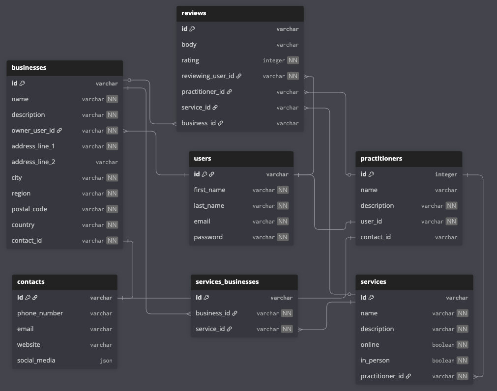

# Alchemy

A personal project to help spiritual and metaphysical practitioners and users connect.

The app is serves a few purposes:

- search for local services as they are difficult to find if you are not part of the local community
- reviews allow users to choose quality practitioners and businesses and avoid frauds
- helps practitioners to be discovered as many don't have physical locations or may work out of multiple locations

### Tech Stack

- Node.js
- TypeScript
- Express
- Postgres
- Prisma
- Vitest
- Supertest

### Database

The database structure has been designed for maximum flexibility. Allowing Users of all kinds from basic Users to Practitioners and Business owners. As the reality is that Practitioners often offer multiple different services and are associated with multiple different local businesses or none at all.

